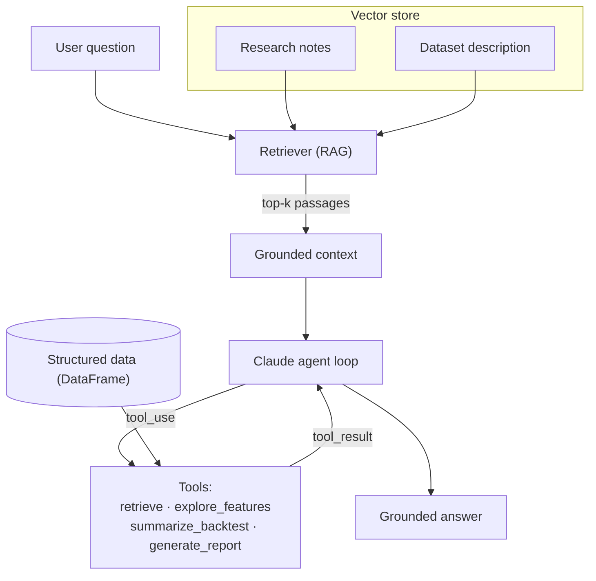

# Quant Assistant

[](https://github.com/yuhangYH/quant-assistant/actions/workflows/ci.yml)

A small but real research assistant that answers analytical questions over market
data and research notes. It combines **retrieval-augmented generation (RAG)** with a
**tool-calling agent loop** on top of Claude, and ships with a command-line interface
and a web app.

> This is an independent project. The bundled dataset is **synthetic sample data** for a
> fictional asset and is used only to make the system runnable end to end. Nothing here
> is investment advice.

**Keywords:** RAG, retrieval-augmented generation, tool calling, function calling, AI agent,
agentic workflow, LLM, Claude, Anthropic, vector search, embeddings, quantitative finance,
market data, backtest analysis, Sharpe ratio, FastAPI, Python.

---

## What it does

- **Grounded answers.** Every question first retrieves relevant passages from an indexed
  corpus (research notes + a description of the dataset), so answers are tied to real
  context instead of the model's parametric memory.
- **Tools, not guesses.** The agent can call typed tools to explore dataset columns,
  summarize a backtest (cumulative return, annualized volatility, Sharpe, max drawdown),
  retrieve more context, and format a report. It calls a tool rather than inventing numbers.
- **Lightweight memory.** A rolling history lets follow-up questions build on earlier turns.
- **Pluggable embeddings.** Voyage AI, local `sentence-transformers`, or a dependency-free
  hashing vectorizer, resolved automatically.

## Architecture



**One question, step by step:**

1. Embed the question and retrieve the top-k passages from the vector store (RAG).
2. Send the question + retrieved context to Claude with the tool schemas attached.
3. While Claude returns `tool_use`, execute the tool against the data and feed the
   `tool_result` back. Tools are small and deterministic, so their output is easy to verify.
4. When Claude stops requesting tools, return the final grounded answer.

## Quickstart

```bash
git clone https://github.com/yuhangYH/quant-assistant.git
cd quant-assistant
python -m venv .venv && source .venv/bin/activate
pip install -r requirements.txt

cp .env.example .env      # then add your ANTHROPIC_API_KEY

# 1) Build the index from the sample data
python -m quant_assistant.cli ingest

# 2) Ask a question (uses your Claude API key)
python -m quant_assistant.cli ask "How volatile has ACME been, and what do the notes say about momentum?" --verbose
```

Run the web app:

```bash
uvicorn web.server:app --reload
# open http://127.0.0.1:8000
```

Run the offline tests (no API key or model download needed):

```bash
pip install pytest
EMBEDDINGS_BACKEND=hashing pytest -q
```

## Run with Docker

The image bakes a retrieval index from the bundled sample data at build time (using the
dependency-free hashing backend, so no secret is needed to build), then serves the FastAPI
app. A Claude API key is only needed at run time for the `/api/ask` endpoint.

```bash
docker build -t quant-assistant .
docker run --rm -p 8000:8000 -e ANTHROPIC_API_KEY=sk-... quant-assistant
# open http://127.0.0.1:8000
```

## Continuous integration

Every push and pull request to `main` runs the test suite on Python 3.10, 3.11, and 3.12
via [GitHub Actions](.github/workflows/ci.yml). The workflow forces the hashing embedding
backend, so CI needs no API key.

## Configuration

All settings come from environment variables (see `.env.example`):

| Variable | Default | Meaning |
| --- | --- | --- |
| `ANTHROPIC_API_KEY` | – | Required for `ask` and the web app. |
| `QA_MODEL` | `claude-sonnet-5` | Claude model used by the agent. |
| `QA_TOP_K` | `5` | Passages retrieved per question. |
| `EMBEDDINGS_BACKEND` | `auto` | `auto` \| `voyage` \| `sentence-transformers` \| `hashing`. |
| `QA_INDEX` | `index.pkl` | Where the built index is stored. |

With `auto`, the retriever uses Voyage AI when `VOYAGE_API_KEY` is set, otherwise a local
`sentence-transformers` model if installed, otherwise a built-in hashing vectorizer so it
always runs.

## Project layout

```
quant_assistant/
  config.py        env-driven settings
  embeddings.py    voyage / sentence-transformers / hashing backends
  vectorstore.py   in-memory cosine-similarity store (+ the structured frame)
  ingest.py        chunk notes, describe the dataset, build the index
  tools.py         tool schemas + deterministic implementations
  agent.py         RAG + tool-calling loop with lightweight memory
  cli.py           `ingest` and `ask`
web/
  server.py        FastAPI app
  static/index.html chat UI
data/sample/       synthetic prices.csv + research_notes.md
tests/             offline tests for retrieval, tools, and index round-trip
```

## Design notes

- **Why retrieve first, then allow more retrieval as a tool?** The upfront retrieval keeps
  the common case cheap and grounded; the `retrieve` tool lets the model widen its context
  when a first pass is not enough.
- **Why deterministic tools?** Backtest and summary math live in Python, not in the prompt,
  so the numbers are reproducible and reviewable, and the model's job is to decide *when* to
  call them and how to explain the result.
- **Evaluation mindset.** The tools report Sharpe and max drawdown alongside cumulative
  return by design, reflecting the habit of never judging a strategy on cumulative return alone.

## License

MIT © 2026 Yuhang Guo
